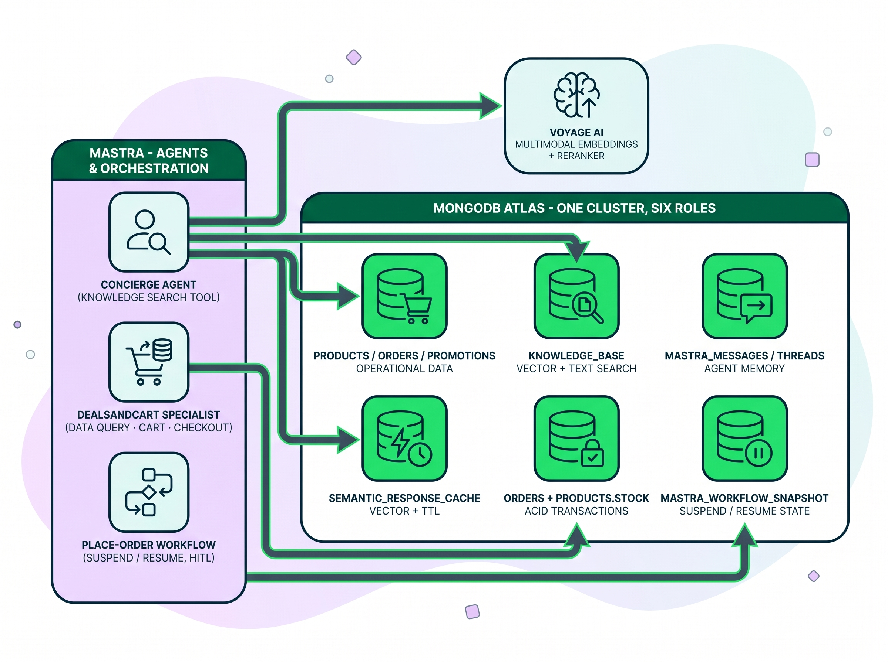
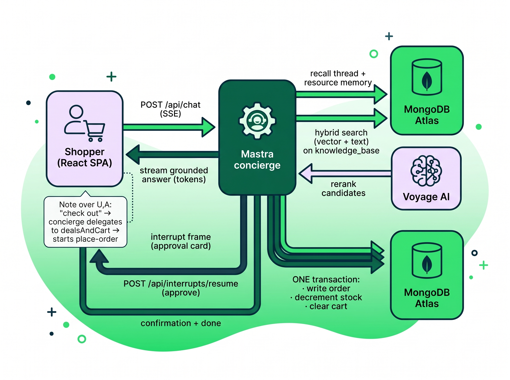

# MongoDB x Mastra Agentic AI Quickstart

A retail shopping concierge that showcases MongoDB x Mastra capabilities, all on a single Atlas
cluster: multimodal retrieval (Voyage multimodal embeddings), hybrid search with reranking (RRF +
Voyage rerank), cross-thread agent memory (Mastra resource-scoped semantic recall + working memory
on MongoDB), a semantic response cache (vector search + TTL), a safety-wrapped natural-language
data agent (NL to MQL), and a human-in-the-loop **order workflow** (Mastra `suspend`/`resume` to
transactional order placement with inventory effects). A Mastra concierge answers knowledge-base
questions directly and delegates live retail data and the cart to a `dealsAndCart` specialist.
TypeScript, Mastra, Hono, and a Vite/React storefront.

See [`ARCHITECTURE.md`](ARCHITECTURE.md) for the "one cluster" diagram and a per-capability code map.

## Better together: Mastra agents on one MongoDB cluster

The story this app tells: **Mastra** supplies the agent, tools, memory, and durable workflow;
**MongoDB Atlas** is the single backbone underneath all of it. No second datastore, no bolt-on
vector database, no separate cache. One cluster plays six roles.

### Architecture

<p align="center">
  
</p>

Runtime path of a single turn:

### Control Flow

<p align="center">
  
</p>

## Quick start (Docker + Studio, one command)

```bash
cp .env.example .env    # fill in MONGODB_URI, VOYAGE_API_KEY, LLM creds
pnpm setup              # provisions Atlas, seeds, builds+runs the app in Docker,
                        # launches Mastra Studio, and opens the browser
```

`pnpm setup` opens the storefront (http://localhost:8000), Mastra Studio (http://localhost:4111),
and the API docs (http://localhost:8000/mastra/api). Transactional checkout requires an Atlas /
replica-set cluster (multi-document transactions). For the manual, process-by-process path, read on.

`pnpm setup` runs Studio on the host. To run it in a container instead, use the opt-in `studio`
compose profile (a plain `docker compose up` runs only the production app):

```bash
docker compose up -d --build                    # app only (storefront + API on :8000)
docker compose --profile studio up -d --build   # app + Mastra Studio (:4111)
```

## Deploy to AWS (one command)

The local Docker path above runs against your own Atlas cluster. To stand up the whole stack in
the cloud instead, `deploy/` has a one-command Terraform deploy: an EC2 box running the app in
Docker behind nginx, a co-located **Atlas M10** reached over **AWS↔Atlas VPC peering** (round-trips
drop from ~250 ms to ~1–5 ms), the LLM on **AWS Bedrock** via the instance role (no API key on the
box), and app secrets delivered through **SSM Parameter Store**.

Before you start, enable **Bedrock model access** for the Claude models you expose (both Sonnet 4.5
and Haiku 4.5) in your target region — approval can take hours, so do it first.

```bash
cp deploy/terraform/terraform.tfvars.example deploy/terraform/terraform.tfvars
# edit terraform.tfvars: aws_region, cluster names, bedrock_model_id, etc. (non-secret)

export TF_VAR_atlas_public_key=...      # secrets via env, never in the file
export TF_VAR_atlas_private_key=...
export TF_VAR_atlas_project_id=...      # deploy into an existing project (recommended)
export TF_VAR_voyage_api_key=...

deploy/scripts/deploy.sh                # add --yes to skip the apply confirmation
```

The wrapper handles everything end to end (~15–20 min): preflight and a Bedrock model-access probe,
`terraform apply`, wait for peering to go **ACTIVE**, seed Atlas from your machine, then health-poll
the public URL. It prints the storefront URL (`http://<public-ip>/`), Studio URL
(`http://<public-ip>:4111/`), the SSH command, and a `verify:demo` reminder. Bring your own cluster
with `create_atlas_cluster = false` + `TF_VAR_mongodb_uri_byo`. Tear it all down with
`deploy/scripts/destroy.sh`.

Every app port is scoped to network ranges you set in `terraform.tfvars`, so nothing is world-open.
See [`deploy/README.md`](deploy/README.md) for the full prerequisites, variables, BYO-cluster path,
Bedrock model-id notes, and teardown.

## Prerequisites

- Node 22 or newer, pnpm (backend), npm (frontend).
- A MongoDB Atlas cluster (vector search enabled).
- A MongoDB Atlas Voyage key and an Anthropic-compatible LLM endpoint (see `.env.example`).

## Setup

1. Copy `.env.example` to `.env` and fill in `MONGODB_URI`, `MONGODB_DATABASE`, `VOYAGE_API_KEY`,
   and the LLM settings. The `.env` is git-ignored; never commit it.
2. Install backend deps: `pnpm install`.
3. Provision indexes, seed data, and ingest the image assets:

   ```bash
   pnpm provision   # knowledge_base vector + search indexes, response cache index + TTL
   pnpm seed        # ~1505 products, 20 orders, 5 promotions, and the text knowledge base
   pnpm embed       # ingest the committed image assets (multimodal)
   ```

### PDF ingestion

The multimodal ingestion step also ingests PDFs. Each page is rasterized to an image and
embedded as one `knowledge_base` document per page (`metadata.mediaType: "pdf"`, `metadata.page`),
so a query can surface a specific catalog page. `pnpm embed` picks up any `mediaType: "pdf"` entry
in `src/ingestion/assets/manifest.json`.

The demo ships a generated `catalog.pdf` (Summer 2026 catalog, derived from the seeded products
and promotions). It is visually rich on purpose (real product photos, color themes, sale ribbons,
coupon tickets) so page-render embedding captures signal a text layer would drop. The product
photos under `src/ingestion/assets/product-images/` are committed CC0 (public domain, no
attribution required, no watermark); `CREDITS.json` records each source. To regenerate:

    pnpm make:catalog            # rebuild catalog.pdf from the committed photos + seeded data
    pnpm fetch:catalog-images    # (optional) re-download the CC0 product photos first

Rasterization resolution is controlled by `INGEST_PDF_SCALE` (default `2.0`).

## Run

Two processes. Start the backend first (it serves on port 8000):

```bash
pnpm dev           # backend on http://localhost:8000
```

Then the frontend (Vite dev server on port 3000, proxying /api to the backend):

```bash
cd frontend
npm install
npm run dev        # storefront on http://localhost:3000
```

Open http://localhost:3000. The storefront loads with a chat assistant. Each preset card drives
one demo beat:

- Multimodal retrieval (HERO): "Show me the summer sale pamphlet and tell me what it is promoting."
- Hybrid + rerank (recipes): "Share a quick pasta recipe I can make tonight."
- Hybrid + rerank (loyalty): "How does your loyalty program work, and how do points convert to rewards?"
- Memory: "Remember that I prefer eco-friendly kitchen products," then "Based on what you know
  about me, what kitchen items would you recommend?"
- Cart / shopping list: "Add the on-sale kitchen product with the biggest savings to my cart and
  show my total savings."
- Semantic cache: "How long does shipping take?" (ask twice to see the instant cached reply).
- NL to MQL data agent: "Show me a few products that are on sale, with their sale prices."

For the human-in-the-loop order workflow, add something to the cart, then say "check out." The
agent pauses for your approval, and on approve places the order in a MongoDB transaction (writes
`orders`, decrements `products.stock`, clears the cart). It is also runnable from Mastra Studio's
workflow runner.

Rate any reply with the thumbs buttons; ratings persist to the `feedback` collection.

## Ports and proxy

The frontend always calls `/api/*`. The two backends differ in how they expose those routes:

- **Dev** (`pnpm dev` → the standalone Hono app in `src/server/app.ts`) serves them at bare
  paths (`/chat`, `/cart`, …), so the Vite dev proxy rewrites `/api/*` → `/*` and forwards to
  port 8000 (`frontend/vite.config.ts`).
- **Prod / container** runs the `mastra build` artifact (`node .mastra/output/index.mjs`), which
  serves the same routes UNDER `/api/*`. So the prod nginx configs (`frontend/nginx.conf`,
  `frontend/nginx.k8s.conf`) **preserve** the `/api` prefix — they do not strip it. Stripping it
  against the deployed artifact would 404 every call.

If you change the backend port, update the dev proxy target in `frontend/vite.config.ts`.

## Tests

- Backend unit tests: `pnpm vitest run` (Atlas integration and smoke suites skip without env).
- Backend + smoke against a live cluster (uses a separate test database so it never touches demo
  data):

  ```bash
  node --env-file=.env --env-file=.env.integration.local node_modules/vitest/vitest.mjs run tests/integration
  ```

  where `.env.integration.local` sets `MONGODB_DATABASE=mongodb_mastra_qs_test` (git-ignored).
- Frontend tests: `cd frontend && npm test`.

## Reset

To wipe the app-owned collections (leaves Mastra-managed `mastra_*` tables intact), then rebuild:

```bash
CONFIRM_DESTRUCTIVE=1 pnpm teardown
pnpm provision && pnpm seed && pnpm embed
```

`teardown` drops app-owned collections, so it requires `CONFIRM_DESTRUCTIVE=1` to run. Both
`teardown` and `seed` also refuse to run against a database whose name looks like production
(matches `prod`/`production`/`live`) unless `FORCE_DESTRUCTIVE=1` is set — a guard against a
mis-pointed `.env` wiping the wrong database.

## Notes

- The `.env` `VOYAGE_API_KEY` is a MongoDB Atlas Voyage key; it authenticates against the
  MongoDB-hosted Voyage endpoint (`VOYAGE_BASE_URL`, default `https://ai.mongodb.com/v1`).
- Human-in-the-loop checkout is implemented: the storefront's approval card drives the order
  workflow via the `/api/interrupts/resume` SSE flow.
- **App logs are persisted to MongoDB.** Every log line still prints to stdout/stderr; when
  `APP_LOG_MONGO_ENABLED=true` (default) it is also written to the `app_logs` collection
  (`APP_LOG_COLLECTION`) — buffered, fail-open, and TTL-pruned after `APP_LOG_RETENTION_DAYS`
  (default 30). A logging failure never blocks a request.
- **Bulk cart-add is intent-gated.** A normal "add X" request adds exactly one product (the
  anti-ballooning guard); only an explicit multi/all request ("add all", "one each") lifts the
  per-turn cap. The agent reports true `cartAdd` results and reads totals from `cartRead` — it
  never fabricates line counts or cart totals.
- **Studio metrics** use an in-memory observability store (MongoDB persists traces but not
  metrics), so the Mastra Studio metrics panel populates. In-memory metrics reset on restart.

### Authentication

The app runs in one of two auth modes, set by `AUTH_MODE`:

- **`local` (default) — no login.** The server trusts the client-supplied `user_id`, and
  `/auth/me` returns a dev user from `DEFAULT_USER_ID`. This is intentional for the demo (it
  lets you switch users to show cross-thread memory), but it means **any client can act as any
  user**. Do not expose a `local` deployment on a public network.
- **`sso` — identity is server-trusted.** Set `AUTH_MODE=sso` and point `AUTH_ADAPTER_MODULE`
  at a deployment-provided adapter (the hosting platform's SSO integration). The adapter validates
  the platform session and supplies the user; client-supplied `user_id`/`thread_id` are ignored, and
  requests without a valid session get `401`. The adapter module lives with the deployment and is
  not part of this repo. It must export `register(register, cfg)` and call `register(fn)` with an
  authenticator `(c) => { userId } | null`. If `AUTH_MODE=sso` and no adapter loads, the app fails
  closed (every request `401`s) rather than trusting client identity.
